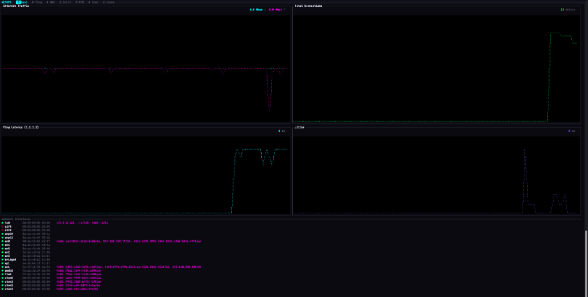

# NetOps - TUI Network Operations Toolkit

NetOps is a powerful, terminal-based network monitoring and diagnostic tool written in Rust. It combines multiple network utilities into a single, cohesive TUI (Text User Interface) optimized for speed and usability.



## Features

NetOps includes a suite of integrated tools accessible via a tabbed interface:

*   **Dashboard**: Real-time overview of network interface status, bandwidth usage (mirrored Rx/Tx graph), active connections, and internet latency.
*   **Ping**: Advanced ping tool with RTT graphing, jitter calculation, and configurable interval/payload size.
*   **DNS Resolver**: Perform DNS lookups for various record types (A, AAAA, MX, TXT, NS).
*   **Packet Sniffer**: Live packet capture and analysis with protocol filtering and detailed inspection.
*   **MTR (My Traceroute)**: Combines traceroute and ping to analyze network hops, packet loss, and latency over time.
*   **Port Scanner (Nmap)**: Integrated Nmap wrapper for network discovery and security auditing.
*   **Connections**: Real-time visualization of active network connections, including:
    *   **ASN Lookup**: Identify the organization behind IP addresses.
    *   **World Map**: Static, high-resolution world map showing the geographic location of connections.
    *   **Visual Analysis**: "Jitter" effect to distinguish multiple connections from the same region.

## Installation

### Prerequisites
*   Rust toolchain (cargo, rustc)
*   `nmap` (if you want to use the Nmap tool)
*   Root/Administrator privileges (required for raw socket access, sniffer, and ICMP features)

### Build from Source

```bash
git clone https://github.com/zachwilke/netops.git
cd netops
cargo build --release
```

## Usage

Since `netops` requires raw socket access for many of its features (Ping, Sniffing), it must typically be run with `sudo`:

```bash
sudo ./target/release/netops
```

### Controls

*   **Navigation**:
    *   `D` - Dashboard
    *   `P` - Ping
    *   `N` - DNS
    *   `S` - Sniffer
    *   `M` - MTR
    *   `R` - Nmap (Scan)
    *   `C` - Connections
    *   `TAB` - Cycle through tabs
*   **Global**:
    *   `Q` or `Ctrl+C` - Quit
    *   `H` or `?` - Toggle Help
*   **Tool Specific**:
    *   `Enter` - Start action (Ping, Resolve, Scan)
    *   `Esc` - Stop action
    *   `Up/Down` - Navigate lists/tables

## Configuration

NetOps relies on a MaxMind GeoLite2 ASN database for geolocation features. Ensure the `.mmdb` file is present in the `GeoLite2-ASN_20251224` directory or update the path in `src/app.rs`.

## Built With

*   [Ratatui](https://github.com/ratatui-org/ratatui) - Rust TUI library
*   [Tokio](https://tokio.rs/) - Asynchronous runtime
*   [Pnet](https://github.com/libpnet/libpnet) - Cross-platform low-level networking
*   [MaxMindDB](https://github.com/oschwald/maxminddb-rust) - IP geolocation

## License

[MIT](LICENSE)
